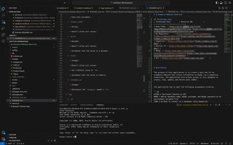
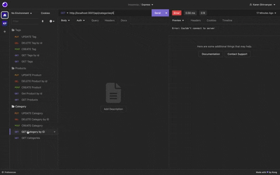
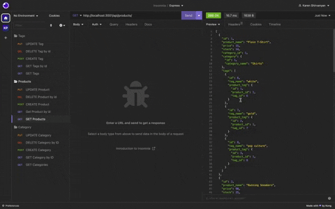
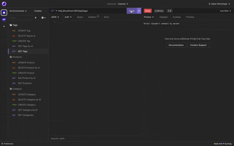
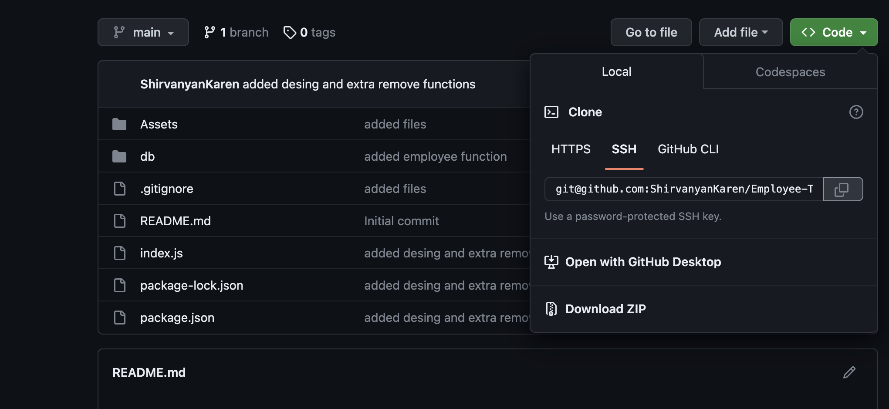
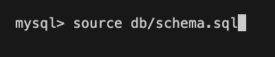
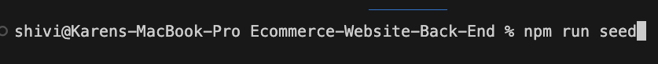
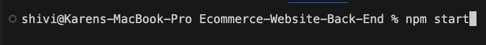

# E-Commerce Website Back-End

## Technology used
| Technology Used         | Resource URL           | 
| ------------- |:-------------:| 
| Demo Video  | [https://drive.google.com/file/d/1mGgipED8Zw4ixZhuqUzNItZ3GwnsT22Y/view](https://drive.google.com/file/d/1mGgipED8Zw4ixZhuqUzNItZ3GwnsT22Y/view) |
| My Repository      | [https://github.com/ShirvanyanKaren/Ecommerce-Website-Back-End](https://github.com/ShirvanyanKaren/Ecommerce-Website-Back-End) |
| Sequelize | [https://sequelize.org/api/v6/class/src/model.js~model](https://sequelize.org/api/v6/class/src/model.js~model) |
| Express JS | [https://expressjs.com/en/4x/api.html#express.router](https://expressjs.com/en/4x/api.html#express.router) |
| MySQL  | [https://dev.mysql.com/doc/](https://dev.mysql.com/doc/) |
| Git | [https://git-scm.com/](https://git-scm.com/)     | 


# Description

The purpose of this application is to create a back end for an ecommerce website that stores information in MySQL via a sequelize conenction. The application also allows access to this database to create, read, update, and delete data (CRUD).


The application had to meet the following acceptance criteria:

```md
GIVEN a functional Express.js API
WHEN I add my database name, MySQL username, and MySQL password to an environment variable file
THEN I am able to connect to a database using Sequelize
WHEN I enter schema and seed commands
THEN a development database is created and is seeded with test data
WHEN I enter the command to invoke the application
THEN my server is started and the Sequelize models are synced to the MySQL database
WHEN I open API GET routes in Insomnia for categories, products, or tags
THEN the data for each of these routes is displayed in a formatted JSON
WHEN I test API POST, PUT, and DELETE routes in Insomnia
THEN I am able to successfully create, update, and delete data in my database
```

Here is an example of how the application runs:

Get requests


Categories endpoints


Products endpoints


Tags endpoints



## Table of Contents
* [Express JS, SQL and Routes](#express-js-and-end-points)
* [Usage and Installation](#usage-and-installation)
* [License](#license)
* [Questions](#questions) 


## Express JS, SQL, and End Points

The E-Commerce Backend application utilized MySQL models via the Sequelize npm package, and allows the user to view and update this data accordingly with the end points constructed 

### Sequelize Models

The models initialized with Sequelize work similarly to SQL tables, defining the data within the columns such as id, and string names. 

```js
Product.init(
  {
    // define columns
    id: {
      type: DataTypes.INTEGER,
      allowNull: false,
      primaryKey: true,
      autoIncrement: true,

    }, 
    product_name: {
      type: DataTypes.STRING,
      allowNull: false,

    },

...

    categroy_id: {
      type: DataTypes.INTEGER,
        references: {
          model: 'Category',
          key: 'id',
        },
    }, 
  }
);
```

Similar to the FOREGIN KEY description in MySQL, sequelize allows us to utilize references that create distinct relations between two models. In this case, we can link products to categories. The explicit relationship between these two models is detailed in the index.js file, a category having many products via the category_id foreign key.

```js
// Products belongsTo Category
Product.belongsTo(Category, {
  foreignKey: 'category_id',
});
// Categories have many Products
Category.hasMany(Product, {
  foreignKey: 'category_id',
});
```

### Express JS End Points

In order for the user to receive/ read the back end data stored for the E-Commerce website, I had create an API endpoint for the Tag, Category, and Product data. In this instance, I created the category endpoint to return all the Category data which included the model of Product to allow the user to see which products are linked to the given category.


```js
router.get('/', async (req, res) => {
 try { // find all categories
  // be sure to include its associated Products
  const categoryData = await Category.findAll({
    include: [{ 
      model: Product,
      attributes: ["id", "product_name", "price", "stock", "category_id"],
    }],
  });
  res.status(200).json(categoryData);
 } catch (err) {
  res.status(500).json('Error in retrieving category data');
 }
});
```

Similarly, I created a 'put' request allowing the user to modify the category given the id using the update method. This updates the data with the new JSON body information that the user provides with their request, targtting the specific object with the 'where : req.params.id' code. 

```js
router.put('/:id', async (req, res) => {
  // update a category by its `id` value
  try {
  const categoryData = await Category.update(req.body, {
    where: {
        id: req.params.id,
    },
  });
  res.status(200).json(categoryData);
 
  } catch (err) {
    res.status(500).json('Error in updating the category')
  }
});
```

Finally, I created a 'delete' request that works similarly to the 'put' request but instead erases data given the object id. It's important to note that althoough these data values are conveyed as JSON objects, these Express JS requests still interact with the actual database via CRUD operations similar to explicit MySQL data handling. 

```js
router.delete('/:id', async (req, res) => {
  // delete a category by its `id` value
  try {
  const categoryData = await Category.destroy({
    where: {
      id: req.params.id,
    },
  });
    if (!categoryData) {
      res.status(400).json({ message: 'No category with that id'})
    }
    res.status(200).json(categoryData);
} catch (err) {
  res.status(500).json('Error in deleting category')
}
});
```


## Usage and Installation

This application can be used to store, manage, delete, and update data from the back end for an E-Commerce Website. 

To use simply clone or fork the repository:



After cloning down the repo, make sure to run npm install to install the necessary dependencies. Following this, you can modify the inputs of the database to your liking within the seeds.sql file. After this, run your mysql and create the database by using "source". 



Run the seed for the data



Run npm start



Finally, you can open an API application such as postman or insomnia and access the database with the given endpoints


## License 
     
MIT licensing with permisions such as commercial use, modification, distribution and private use. Limitations include liability and warranty.

## Questions 

* Check out my other projects on my [my Github](https://github.com/ShirvanyanKaren)
* For any additional questions or concerns, please email me at kshirvanyan2000@gmail.com